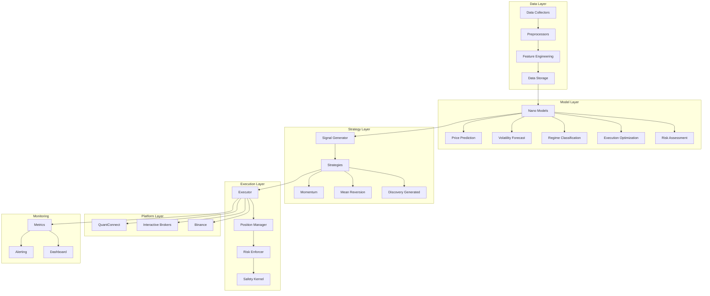

# QantmOrchstrtr-RSI Trading Vertical

**Version**: 0.1.0 | **Last Updated**: February 20, 2026 — ARY-1148 AARA Enforcement

> **ARY-1148 — AARA Enforcement**: All trading API operations must go through AARA: `POST /api/v1/aara-engine/invoke` on port 8000. See [AARA Enforcement Architecture](../../docs/aara/enforcement_architecture.md).

## Overview

The Trading vertical implements AARA's algorithmic trading capabilities, enabling autonomous trading across crypto, equities, and forex markets. It integrates with the core QantmOrchstrtr-RSI framework to provide:

- **Nano Model-Based Predictions**: Specialized models for price prediction, volatility forecasting, regime classification, and risk assessment
- **Strategy Discovery & Evolution**: AARA Discovery Engine integration for autonomous strategy generation
- **Multi-Platform Execution**: Unified interface for QuantConnect, Interactive Brokers, and Binance
- **Safety-First Design**: GLASSBOX/CDAI compliant models with Safety Kernel integration

## Architecture



## Directory Structure

```
verticals/trading/
├── nano_models/           # Trading-specific nano models
│   ├── price_prediction/  # NM-TRADE-001 to 005
│   ├── volatility_forecast/  # NM-TRADE-006 to 008
│   ├── regime_classification/  # NM-TRADE-009 to 010
│   ├── execution_optimization/  # NM-TRADE-011 to 012
│   ├── risk_assessment/   # NM-TRADE-013 to 015
│   ├── base.py           # Base nano model class
│   └── registry.py       # Model registration
├── strategies/           # Trading strategies
│   ├── momentum/         # Trend-following strategies
│   ├── mean_reversion/   # Mean reversion strategies
│   ├── discovery_generated/  # AARA-generated strategies
│   ├── base.py          # Base strategy class
│   └── registry.py      # Strategy registration
├── data/                # Data pipelines
│   ├── collectors/      # Data collection
│   ├── preprocessors/   # Data cleaning
│   ├── feature_engineering/  # Feature computation
│   └── storage/         # Data versioning
├── integration/         # Platform integrations
│   ├── quantconnect/    # QuantConnect connector
│   ├── interactive_brokers/  # IB connector
│   └── binance/         # Binance connector
├── backtesting/         # Backtesting infrastructure
├── execution/           # Live execution framework
├── monitoring/          # Performance monitoring
├── scripts/             # Utility scripts
├── configs/             # Configuration files
├── docs/                # Documentation
└── tests/               # Integration tests
```

## Nano Models

| ID | Category | Description | Timeframe |
|----|----------|-------------|-----------|
| NM-TRADE-001 | Price Prediction | 1-minute price forecast | 1m |
| NM-TRADE-002 | Price Prediction | 5-minute price forecast | 5m |
| NM-TRADE-003 | Price Prediction | 15-minute price forecast | 15m |
| NM-TRADE-004 | Price Prediction | 1-hour price forecast | 1h |
| NM-TRADE-005 | Price Prediction | 4-hour price forecast | 4h |
| NM-TRADE-006 | Volatility Forecast | 1-hour volatility | 1h |
| NM-TRADE-007 | Volatility Forecast | 4-hour volatility | 4h |
| NM-TRADE-008 | Volatility Forecast | 1-day volatility | 1d |
| NM-TRADE-009 | Regime Classification | Short-term regime | 1h |
| NM-TRADE-010 | Regime Classification | Medium-term regime | 4h |
| NM-TRADE-011 | Execution Optimization | Crypto execution | - |
| NM-TRADE-012 | Execution Optimization | Equities execution | - |
| NM-TRADE-013 | Risk Assessment | VaR estimation | 1d |
| NM-TRADE-014 | Risk Assessment | Expected Shortfall | 1d |
| NM-TRADE-015 | Risk Assessment | Drawdown probability | 1d |

## Quick Start

### 1. Set Up Environment

```bash
# Clone the repository (if not already done)
cd /path/to/QantmOrchstrtr-RSI

# Install dependencies
pip install -e ".[trading]"

# Set up environment variables
cp verticals/trading/configs/development.yaml.example verticals/trading/configs/development.yaml
```

### 2. Configure API Credentials

Set the following environment variables for your trading platforms:

```bash
# Binance (testnet for development)
export BINANCE_TESTNET_API_KEY="your_testnet_key"
export BINANCE_TESTNET_API_SECRET="your_testnet_secret"

# Interactive Brokers (optional)
export IB_HOST="127.0.0.1"
export IB_PORT="7497"  # Paper trading port

# QuantConnect (optional)
export QC_USER_ID="your_user_id"
export QC_API_TOKEN="your_api_token"
```

### 3. Test API Connections

```bash
python verticals/trading/scripts/test_api_connections.py --platform binance
```

### 4. Run a Backtest

```bash
python verticals/trading/scripts/backtest_strategy.py \
    --strategy simple_momentum \
    --symbols BTC/USDT \
    --start 2024-01-01 \
    --end 2024-12-31
```

### 5. Deploy to Paper Trading

```bash
python verticals/trading/scripts/deploy_live.py \
    --strategy simple_momentum \
    --mode paper \
    --platform binance
```

## Development Workflow

### Adding a New Nano Model

1. Create a new file in the appropriate category directory:
   ```
   verticals/trading/nano_models/price_prediction/new_model.py
   ```

2. Inherit from `BaseNanoModel`:
   ```python
   from verticals.trading.nano_models.base import BaseNanoModel, NanoModelConfig
   
   class NewPriceModel(BaseNanoModel):
       def predict(self, features):
           # Implementation
           pass
       
       def train(self, X, y, validation_split=0.2):
           # Implementation
           pass
       
       def explain(self, features):
           # Implementation for GLASSBOX compliance
           pass
   ```

3. Register the model in `registry.py`:
   ```python
   from verticals.trading.nano_models.registry import register_model
   
   @register_model("NM-TRADE-NEW")
   class NewPriceModel(BaseNanoModel):
       ...
   ```

4. Add tests in the `tests/` subdirectory.

### Adding a New Strategy

1. Create a new file in the appropriate category directory:
   ```
   verticals/trading/strategies/momentum/new_strategy.py
   ```

2. Inherit from `BaseStrategy`:
   ```python
   from verticals.trading.strategies.base import BaseStrategy, Signal
   
   class NewMomentumStrategy(BaseStrategy):
       def generate_signals(self, market_data):
           # Implementation
           pass
       
       def calculate_position_size(self, signal, portfolio_value, positions):
           # Implementation
           pass
       
       def validate_signal(self, signal, market_data, positions):
           # Implementation
           pass
   ```

3. Register the strategy in `registry.py`.

4. Add tests and run backtests to validate.

### Adding a New Platform Integration

1. Create a new directory under `integration/`:
   ```
   verticals/trading/integration/new_platform/
   ```

2. Implement the connector interface:
   - `connector.py`: Main connection and authentication
   - `order_manager.py`: Order submission and tracking
   - `tests/`: Integration tests

## Testing

### Run Unit Tests

```bash
# Run all trading vertical tests
pytest verticals/trading/ -v

# Run specific test category
pytest verticals/trading/nano_models/price_prediction/tests/ -v
```

### Run Integration Tests

```bash
pytest verticals/trading/tests/integration/ -v
```

### Run Backtests

```bash
python verticals/trading/scripts/backtest_strategy.py \
    --strategy simple_momentum \
    --symbols BTC/USDT,ETH/USDT \
    --start 2024-01-01 \
    --end 2024-12-31
```

## Deployment

### Paper Trading

Paper trading uses real market data but simulates order execution:

```bash
python verticals/trading/scripts/deploy_live.py \
    --strategy simple_momentum \
    --mode paper \
    --platform binance
```

### Live Trading

**⚠️ WARNING**: Live trading uses real money. Ensure thorough testing first.

```bash
python verticals/trading/scripts/deploy_live.py \
    --strategy simple_momentum \
    --mode live \
    --platform binance \
    --confirm
```

## Safety & Risk Management

### GLASSBOX/CDAI Compliance

All risk-critical nano models (NM-TRADE-013 to 015) use GLASSBOX-compliant architectures:
- Rules-based decision making
- Full explainability
- Deterministic outputs
- Complete audit trails

### Safety Kernel Integration

The execution framework integrates with AARA's Safety Kernel for:
- Pre-trade risk validation
- Position limit enforcement
- Daily loss limits
- Emergency stop functionality

### Risk Parameters

Configure risk limits in `configs/`:
- `max_position_size`: Maximum position as % of portfolio
- `max_daily_loss`: Daily loss limit (triggers emergency stop)
- `max_drawdown`: Maximum drawdown limit
- `max_open_positions`: Maximum concurrent positions

## Related Documentation

- [**Trading System Architecture**](../../docs/trading/architecture.md) - Comprehensive architecture documentation
- [Architecture Overview](docs/architecture.md) - Quick architecture reference
- [Nano Models Guide](docs/nano_models.md)
- [Strategies Guide](docs/strategies.md)
- [Data Pipeline Guide](docs/data_pipeline.md)
- [Platform Setup Guide](docs/platform_setup.md)
- [Deployment Guide](docs/deployment.md)

## Related Issues

- [ARY-1078](https://linear.app/aryalabs/issue/ARY-1078): Setup Trading Platform Accounts
- [ARY-1080](https://linear.app/aryalabs/issue/ARY-1080): Setup Development Environment
- [ARY-1081](https://linear.app/aryalabs/issue/ARY-1081): Create Architecture Documentation
- [ARY-1082](https://linear.app/aryalabs/issue/ARY-1082): Historical Data Collection Pipeline
- [ARY-1083](https://linear.app/aryalabs/issue/ARY-1083): Real-time Data Feed Integration
